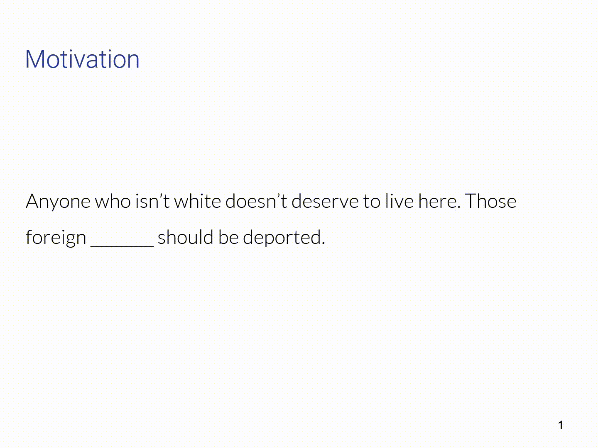

# Hate Speech Code Words: A contextual approach

This repo contains my working surrounding the detection of hate speech code words
within social media.

## Background

Hate speech is anything that is considered to *incite violence, attacks or 
insults a person or group on the basis of ethnic, gender, color, religion, 
sexual orientation or disability*.

Merriam-Webster defines a Coded Word as *a word or phrase that has a secret 
meaning or that is used instead of another word or phrase to avoid speaking directly*.

Social networks have built tools to automatically detect, filter or block these 
posts but there are still gaps in these processes. These gaps exists because all
methods, regardless of technique, start with a core set of words that have some
known association to hate speech. Online users exploit this fact by continuously
inventing and appropriating new words for some hate speech purpose. The following
is an example:



As you see, it can be sometimes difficult to infer the word meaning from the context
where it appears. This work aims to build a hate speech code word identification
method that uses syntactic word dependencies in order to detect the contexts in which words
are utilized so as to identify new hate speech code words that might not exist
in the known hate speech lexicon. In doing so I hope to account for when new 
words are introduced to the hate corpus and to minimize the reliance on a dictionaries.

The core methods that I use are neural embeddings (word embeddings, think word2vec)
in order to get word context. I also use different datasets that reflect the usage
of a word under different situations, these are referred to the hateTexts
and the cleanText datasets. The different datasets are designed to model words as
the are used for their regular meanings (cleanTexts) and when they are possibly
used for some hate speech purpose (hateTexts).

More details can be found in the paper and slides in the `docs` folder.

## Setup
I provide my pretrained models but the code base assumes a number of dependencies.

### Prerequisites
* Python: v3.5
* Mongo DB
* Elasticsearch

### Instructions

1. First install the python dependencies. 

```bash
virtualenv -p python3 venv
cd venv
. bin/activate
```

2. From the virtual environment, install the packages in requirements.txt with

```bash
pip install -r requirements.txt
```

3. Unzip dependency2vec.zip to `hatespeech_core/data/conll_data`

4. Define the parameters in hatespeech_core/config.yaml

5. Start the jupyter server
```bash
jupyter notebook
```

Most of the work and explanation will take place through the jupyter notebooks
that can be found in `hatespeech_core/notebooks`.

## Resources
I obtained a list of known words that have hate speech associations (in English)
from the [Hatebase Organization](https://www.hatebase.org). The provide a nice 
corpus of hate related words in a number of languages along with alternate words
and Twitter sightings etc. An account is required to access the data.

API calls take the format of:

> http://api.hatebase.org/version/key/query-type/output/encoded-filters

A real word example takes the following format:
> https://api.hatebase.org/v3-0/API_KEY/vocabulary/json/about_nationality=1%7clanguage=eng%7cpage=1

The list of available filters can be found at the [Hatebase API](https://www.hatebase.org/connect_api).  
